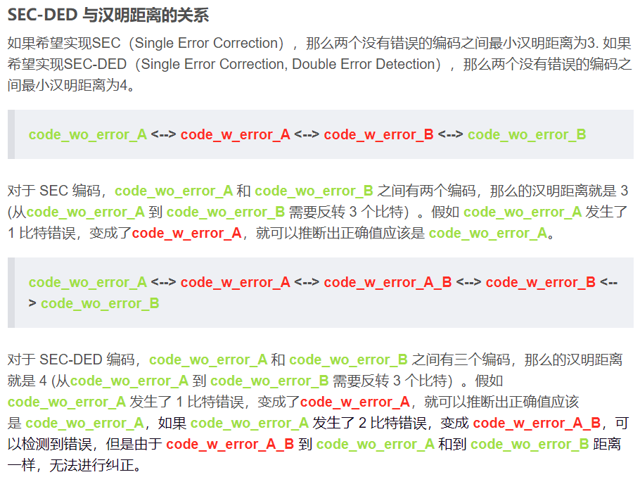
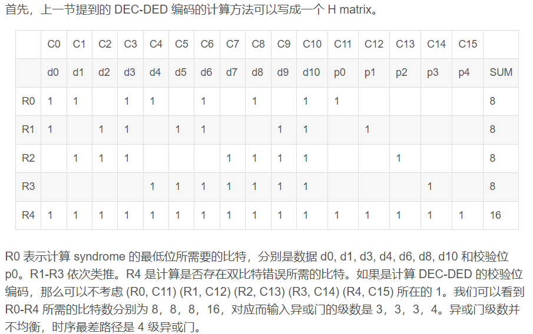
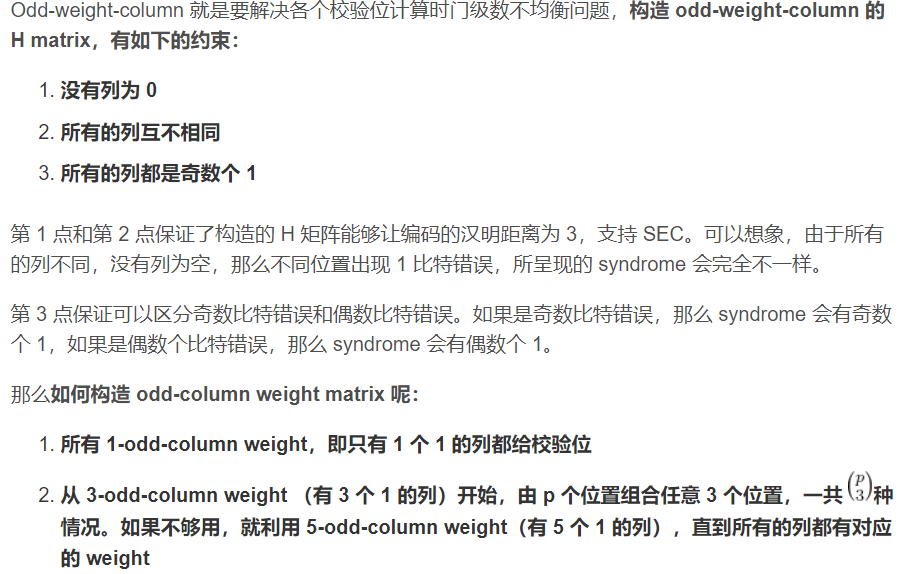
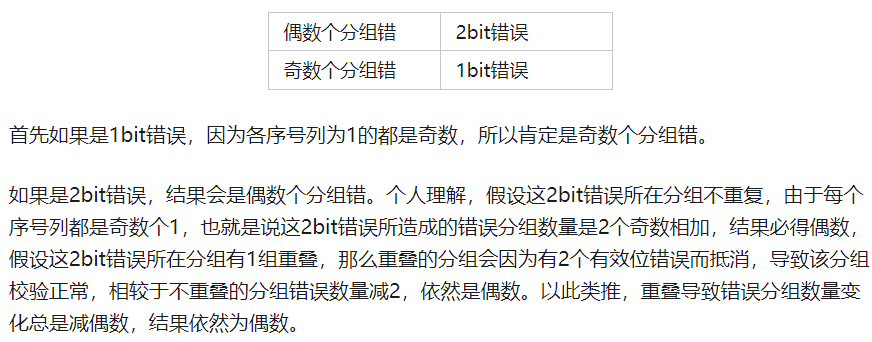
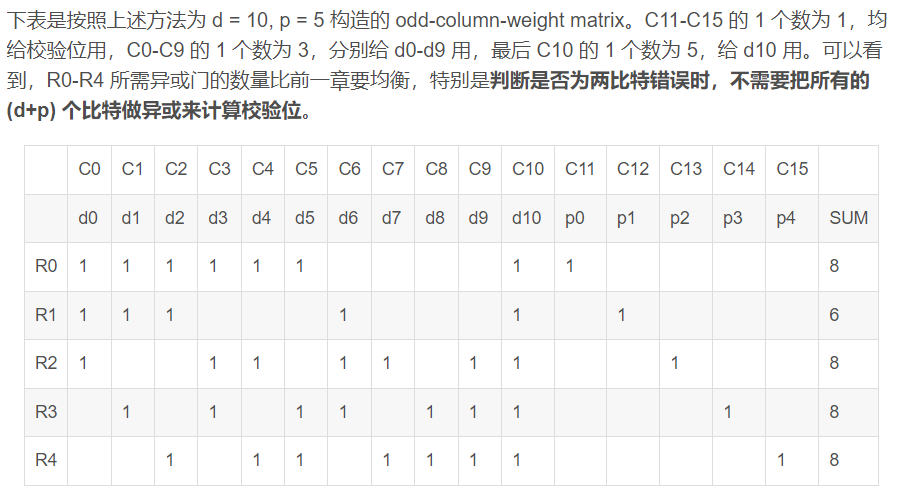

# Hsiao对hanming的优化

## hanming距离与SEC-DED

```
汉明距离:表示两个编码之间的bit差异
	8'b01001011 与 8'b01011001 直接有2bit翻转,所以hanming距离为2

SEC要求两个编码之间hanming距离要为3 (2d+1)
DED要求两个编码之间hanming距离要为4 (2d)
```



```
纠错原理:就是判断你读到的数据离那个合法的码最近就恢复成对应值
A----x----B----y----C
我们核心的假设是他犯的错尽可能的少
则我们收到的B要恢复成A,所以要y>x
两个合法码AC之间的hanming距离为x+y
	x+y > 2x 即hanming距离要从2x+1开始
即SEC表示一个错误要能恢复,即x=1,则距离要为3
即DED表示两个错误要能检测出来,即x==y才能检查出来但恢复不了,即x=2,距离为4
```

## hanming原理

```
海明纠错码的逻辑是,通过公式对数据再次编码,将hanming距离为1的合法码
扩充成具有非法码的hanming距离为4的编码值产生可以检错纠错的前置条件

其次再对将合法值均匀分布,各个参数正交,适合通过多维二分进行锁定
核心时二分法,log2个维度才可唯一确定
```

## Hasio Odd-weight-column  SEC-DED

```
而Hasio的Odd-weight-column SEC-DED Code (奇权重列SEC-DED)
一种相对于Hanming更快的计算方法,更快是因为减少了异或门级数
```





```
关于1.2保证hanming距离为3的解释:
	因为2的整幂次全给了校验位,所以1.2.4全是校验位,又不允许全0编码,所以对于只有一个合法值不需要校验,>=两个合法值时,已经存在了3bit校验位,依据code & data参与运算时,若从一个合法值跳到另一个合法值已经至少变化3bit数据了,hanming距离>=3
	
关于3保证区分奇数比特和偶数比特错误的解释:
```



### Haiso最终目的



简化了关于双检错DED时的异或逻辑门级数,使异或逻辑门级数更加均衡,时钟周期可以更加均匀

# 总结

```
SEC的基本思想就是利用二分法来对不同组的数值计算校验位

Odd-colunm-weight可以构造出逻辑级数更少的产生校验位的方法,关键在于DED不再需要将SEC所有的数值和校验位再做一次校验
```

